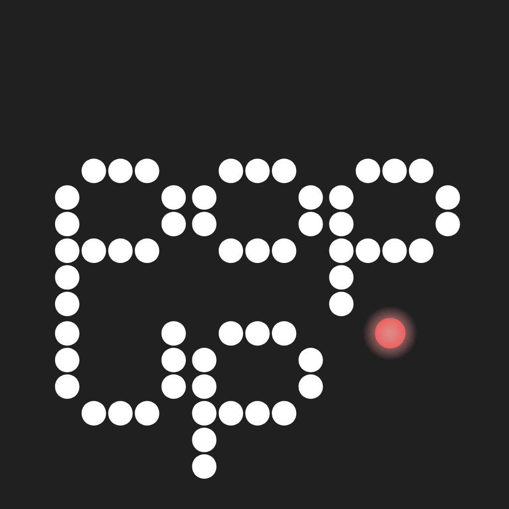

# popup — one-hotkey sticky note



Minimal Raycast-Notes-style sticky for macOS. One global hotkey toggles a small
mono-font panel. Auto-saves to `~/Documents/Popup.md`. MIT open source.

Default: Gruvbox Dark, JetBrains Mono 14px, `Command+Shift+Space`.

## Dev

```sh
cd popup
npm install
npm run tauri dev
```

## Build (DMG)

```sh
npm run tauri build
```

## Customization

Gear menu in the panel: theme (Gruvbox Dark/Light, Raycast Dark/Light, System),
font (JetBrains / SF / Plex Mono), size, width, blur, always-on-top, hotkey,
launch-at-login. Stored in `localStorage`, note in `~/Documents/Popup.md`.
